


 

  

**I build backend systems that keep working when things go wrong:** queues that retry, pipelines that recover, and APIs that stay fast.

SDE-I at a YC-backed insurtech · Merged into NestJS, Mermaid, and Vitest · Open to backend and full-stack roles

 

### ◆ &nbsp;Impact in production


 

### ◆ &nbsp;Experience


<b>Read the details</b>

 

**Bimaplan** · Software Development Engineer I · Nov 2025 – present · Chandigarh  
YC-backed insurtech platform

- Built proxy modules for **four insurers** (Kotak, Bajaj, ICICI Pru, Tata AIG) with **AES-256-CBC** encryption and **JWT** authentication, staging documents in S3.
- Engineered an event-driven claims document pipeline (NestJS, TypeORM, S3, OCR, batch ingestion) that made claim processing **65% faster**.
- Designed **AWS SQS FIFO** processing with a dead-letter queue, visibility-timeout tuning, and retry workflows, giving **90% fewer** unhandled errors.
- Delivered a backdated bulk upload of **33,624 policy rows**, and applied TypeORM indexing that cut database response time by **55%**.
- Led partner onboarding: REST API contracts and data schemas for claims, policies, and integrations, on infrastructure running at **99.8% uptime**.

**Vosyn** · Full-Stack Engineer · Jun – Nov 2025 · Remote  
LinkedIn Top Startups Canada #4, 2025

- Built an **i18n framework** that lazy-loads each locale from a CDN, making translation deploys **60% faster**.
- Engineered a custom HTML5 audio player with WebVTT subtitles that shrank the bundle by **180 KB**.
- Reached a **95+ Lighthouse** score and **98%** mobile usability through code-splitting.
- Handled **10K+ concurrent** WebSocket translation requests at **99.5%** uptime, and shipped 15+ features across three time zones with GitHub Actions CI/CD.

 

### ◆ &nbsp;Open source: merged upstream

  <a href="https://github.com/nestjs/nest/pull/17625"></a>
  <a href="https://github.com/mermaid-js/mermaid/pull/8236"></a>
  <a href="https://github.com/vitest-dev/vitest/pull/11271"></a>

&nbsp;&nbsp;♿ Also contributed accessibility work to the <b>Cboard AAC platform</b>: WCAG 2.1 AA fixes that raised its accessibility score from 78% to 94% for 10K+ users with speech disabilities.

  

### ◆ &nbsp;Things I've built

  
  
  <a href="https://github.com/Raj4478/Socially"></a>
  <a href="https://github.com/Raj4478/Hospital_Management"></a>

&nbsp;&nbsp;More: <a href="https://github.com/Raj4478/linkedin-pipeline"><b>linkedin-pipeline</b></a>, an automated pipeline that writes system design, web dev, and career posts for Indian SDEs.

  

### ◆ &nbsp;Stack


Specialties: AES-256-CBC + JWT · SQS FIFO + dead-letter queues · OCR document pipelines · TypeORM migrations and query tuning · presigned S3 URLs · cron and batch pipelines · partner API onboarding · i18n over CDN · real-time WebSockets

  

### ◆ &nbsp;Activity


Rendered from the GitHub API by a daily Action in this repo, so it never depends on a third-party stats service.

  

**First, solve the problem. Then, write the code.**

